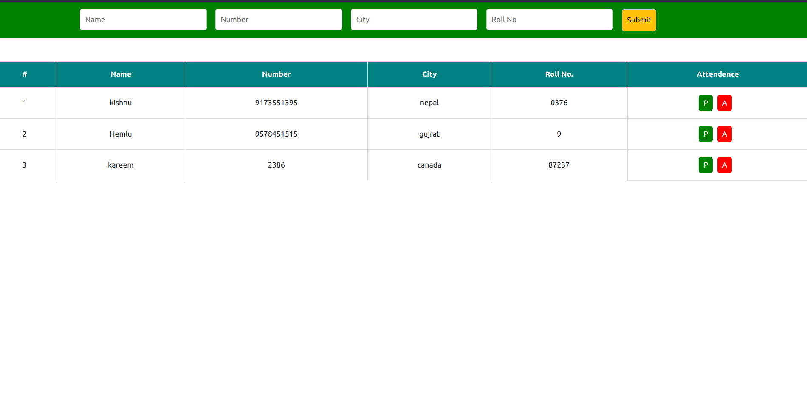

# Learning Hub Project [- Simplifying Education-]

Welcome to the Learning Hub project! This repository contains a web application that provides students with access to various learning materials and an embedded compiler. Teachers can also manage student data and attendance through a dedicated module.

## Features

- **Student Login**: Students can log in to access study materials, PDF notes, examples, and an embedded compiler.
- **Teacher Login**: Teachers can log in to manage student information and attendance.
- **Learning Materials**: A wide range of learning resources available to students.
- **Embedded Compiler**: Students can practice coding within the platform.
- **Teacher Module**: Teachers can manage student records and track attendance.

## Screenshots

### Home Dashboard

### Learning Materials

### Teacher Dashboard

###Attendance Dashboard

## Getting Started

Features
Student Login: Students can log in using their credentials to access the learning materials available on the platform.
Teacher Login: Teachers have their own login credentials and can access a module to manage student information and attendance.
Learning Materials: Students can access a variety of learning materials such as study materials, PDF notes, examples, and more.
Embedded Compiler: An embedded compiler is provided for students to practice coding directly on the platform.
Teacher Module: Teachers can log in to manage student data, including attendance and other relevant information.
Getting Started
To get started with the Learning Hub project, follow these steps:

Clone the Repository: Clone this repository to your local machine using the following command:

bash
Copy code
git clone https://github.com/krrish9783/learning-hub.git
Database Setup: Create a MySQL database to store user and attendance information. You can use the following credentials for database access:

Username: krishna
Password: yadav
Import the necessary SQL files provided in the database directory to set up the database schema.

Web Server Setup: Host the project on a web server with PHP support. You can use tools like XAMPP or WAMP to set up a local development environment.

Access the Platform:

Student Access:

URL: http://localhost/learning-hub
Username: krishna
Password: 61366136

Teacher Access:

URL: http://localhost/learning-hub/teacher
Username: teacher
Password: 12345

Database access
username:krishna
password:yadav

Explore and Learn: Once logged in, students can explore the learning materials and use the embedded compiler for coding practice. Teachers can access the teacher module to manage student data and attendance.

Contributing
If you'd like to contribute to the Learning Hub project, feel free to submit pull requests. You can contribute by adding new learning materials, improving the user interface, enhancing the teacher module, or fixing any issues.

License
This project is licensed under the MIT License.

Contact
If you have any questions or need assistance, please contact the project owner:

kishnu kumar
kishnuyadav783@gmail.com.com
We hope the Learning Hub project enhances the learning experience for students and simplifies attendance management for teachers. Happy learning!
